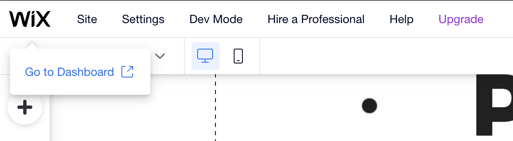

# How to refresh NFT metadata on OpenSea?

1. Open your NFT's page on OpenSea. You can find your NFTs at [https://opensea.io/account](https://opensea.io/account)
2. Press on "Refresh metadata" in the top right corner, and refresh the page. Repeat several times until the NFT reveals

